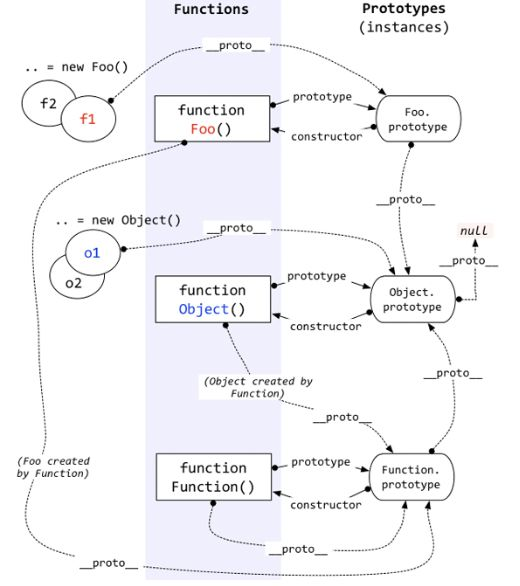

## 原型链



1. 除了基本数据类型，所有数据都是对象类型，也都是 `new 函数` 构造出来的，比如

::: details 样例代码

```js
obj = new Object()    // 普通对象，字面量对象也可以认为是 Object 函数 new 出来的
func = new Function() // 普通函数可以认为是 Function 函数 new 出来的
```

:::

2. 函数也是对象，但比较特殊都有一个名为 `prototype` 的属性，其值为一个普通对象，这个对象有 `constructor`属性，这一属性指向函数对象自身。

3. 所有对象都有一个隐式原型属性 `__proto__` ，指向该对象被new创建时使用的函数的 `prototype` 属性对象。

所有的 JavaScript 对象都会从一个 prototype（原型对象）中继承属性和方法。即当访问一个对象的属性时，先查找对象本身属性，再递归从原型对象查找，这种属性查找的方式被称为原型链（prototype chain）。

`new func` 构造一个对象，其具体过程如下：

1. 生成一个空对象，用 `this` 表示
2. 让空对象 `[[Prototype]]` 为函数 `func` 的 `prototype` 属性
3. 正常执行函数
4. 如果函数返回基本数据类型，则返回 `this` ，否则返回函数返回值。**没有显式返回值的函数，默认返回 `undefined` 。**

### 类型判断

使用 `typeof` 来判断基本数据类型，用 `instanceof` 判断一个实例是否属于某种类型（原型链判断）

::: details instanceof 可能的实现

```js
function new_instance_of(leftVaule, rightVaule) { 
    let rightProto = rightVaule.prototype; 
    leftVaule = leftVaule.__proto__;
    while (true) {
        if (leftVaule === null) { // 原型链顶端为 null
            return false;
        }
        if (leftVaule === rightProto) {
            return true;
        } 
        leftVaule = leftVaule.__proto__ 
    }
}
```

:::

注意：

1. `typeof` 不能判断对象具体类型，会判定 `null` 为对象类型(`instanceof` 认为不是)

2. `instanceof` 判断数组为对象

## this 指向

1. 函数在浏览器全局环境中被简单调用，非严格模式下`this`指向`window`; 在`use strict`严格模式下指向`undefined`.
2. 当一个函数被调用时，拥有它的 object 会作为 `this` 传入。
3. bind/call/apply 改变 `this` 指向
4. new 函数生成对象时（不考虑 return 其他对象情况），指向生成的对象
